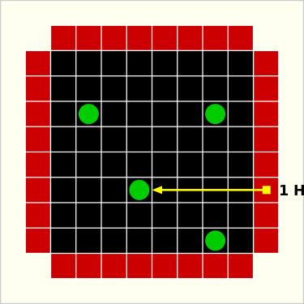
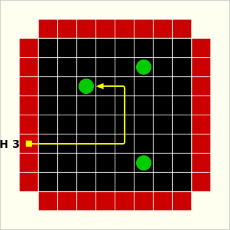
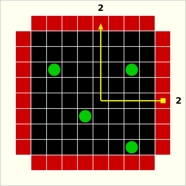
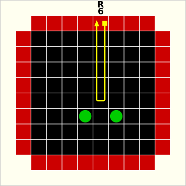
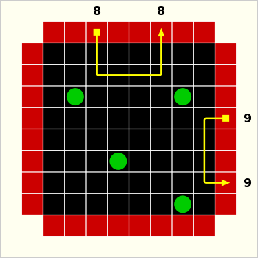

# SoSe19_Padi02: BLACK BOX

## Proposal

### Motivation
This repository will contain an implementation of the logic board game "Black Box" in C++.
It's an abstract game which was designed by the mathematician Eric Solomon in the year 1976.

Today this board game is not well known.
I coincidentally learnt about it on the 35C3 event in Leipzig.
There were some people with a self-made electronic table for various board games, which worked with light receptors and LEDs.
One of the available games was Black Box.

An overview can be found [here](https://en.wikipedia.org/wiki/Black_Box_\(game\)).

### Implementation Ideas
This board game will be implemented by using C++ and presumably OpenCV.

At first I will implement the basic game with the basic rule set.
That is 3-5 atoms in a two-dimensional grid (8x8).

## Game

### Objective
Black Box is played on a two-dimensional grid.
The objective is to find the correct positions of the atoms by the use of the minimum number of rays.

### Rules

#### General
The most common configuration is 3-5 atoms in a 8x8 grid.
There are in total 32 input/output positions for the rays.

In this implementation the computer will hide the correct position of the atoms.
The player has to place the known number of atoms into the grid.
As soon as the player has done that, he/she can log in his/her solution in order to find out if the correct guess was made.

The player can fire a ray by pressing on one of the i/o positions at the edges of the grid to obtain a clue.
The score will be increased by doing this.

#### Hit

#### Deflection

#### Reflection

#### Miss

